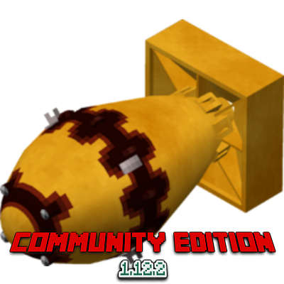

### [**English 🇺🇸**](README.md) / [**Русский 🇷🇺**](README_ru.md) / [**简体中文 🇨🇳**](README_zh.md) / [**한국어 🇰🇷**](README_kr.md) / **Українська 🇺🇦**

<h1 align="center"> <u>HBM's Nuclear Tech Mod Community Edition</u>   
	
    
	
     
</h1>

Повноцінний та найбільш закінчений порт мода HBM's Nuclear Tech Mod з версії 1.7.10 до 1.12.2.
Оскільки інші розробники перестали підтримувати и оновляти свої форки, на світ з'явився цей порт.

> **ВАЖЛИВО: ПРИ ПОДАЧІ БАГ-РЕПОРТУ У ВКЛАДЦІ ISSUE ДОТРИМУЙТЕСЬ ШАБЛОНУ!**  
> У зв'язку з кількістю одержуваних баг-репортів були введені суворі обмеження у виді шаблона для баг-репортів.
За подачею баг-репорта не за шаблоном слідує закриття issue без попередження. Правило не застосовується
ретроспективно (тобто не діє на репорти, подані раніше 5 вересня). Прохання поважати чужий труд
и цінувати чужий час.

> **ВАЖЛИВО: Якщо у вашій збірці є Universal Tweaks, виставте у конфізі `B:"Disable Fancy Missing Model"` на `false` щоб виправити поворот у моделей**  
> Рядок можно знайти у файлі `config/Universal Tweaks - Tweaks.cfg`

 

 

### Чи готовий мод для гри у виживання?

Хоча мод все ще потребує у великій кількості багфіксів, з ним вже можна грати у виживання без фатальних помилок та вильотів.
Однак у мода все ще є достатня кількість дрібних та не дуже багів, а також потрібно портувати деякі дрібні речі.

### Чи сумісний порт з аддонами для NTM: Extended/шейдерами?

На жаль, ні. Встановлення аддонов під EE (наприклад, HBM/NTM structure) наймовірніше призведе до постійних крашів і вильотів; через нещодавно портованої системи зброї
шейдери також несумісні. Ви зі 100% шансом помітите серьйозні артефакти, як тільки візьмете зброю у руки.  
Також шейдери несумісні з небом з NTM-а; однак це можна виправити у файлі 'config/hbm -> hbm.cfg' зміною значення рядка 'B:1.00_enableSkybox=true' на 'false'.  
Ми працюємо над фіксом для шейдерів, однак це займе час.

### Наскільки порт відрізняється від версії Extended?

**Світи з Extended-версії повністю НЕсумісні!**  
Нами було переписано ~75% всього мода в процесі порту всіх доступних нам фіч.
Кількість змін на цей момент вже важко відстежити. Ми запрошуємо вас переглянути вкладку «Issues» нашого репозиторію, оскільки ми її
використовуємо для відстеження доданого контенту.

### Чому б не поліпшити версію Extended?

Алькатер (Alcater) не оновлював свою версію на Curseforge більше півтора року, лише зрідка закидаючи commit-и на свій репозиторій;
у його версії також є безліч «пляшкових горлечок» в питанні оптимізації, а також у нього дивний підхід до введення
деяких фіч, не кажучи вже про його відмову у співпраці з нами, через що ми вирішили відокремитися і працювати без зайвих перешкод.

### Якщо мод знаходиться в розробці, навіщо публікувати його на CurseForge?

**Нам потрібні баг-репорти і бажані нові розробники.**  
Очевидно, що без присутності на великих майданчиках на кшталт CurseForge/Modrinth наше охоплення гравців знижене до мінімуму.
Ми хочемо, щоб люди знали, що у мода є відмінний повноцінний порт, який досі в розробці; і, отже, ми хочемо
отримати потенційну допомогу в розробці як опосередковано, через баг-репорти, так і безпосередньо, через pull-request-и.  
Ми завжди раді новим учасникам!

### Чи будуть у цього порту модифікації для певних збірок?

**Ні!**  
Так, спочатку порт був створений як частина проекту WarFactory. Однак, тепер ми його підтримуємо як окремий мод. Будь-які зміни від 1.7.10
вкрай незначні і зроблені переважно з метою поліпшення оптимізації, сумісності, стабільності, або для спрощення розробки мододелам і збирачам
модів. Але ніяких прямих змін в моді для певних збірок НЕ буде.

### Чи плануєте ви портувати мод на версію 1.1x/1.2x?

**Ні, ми не плануємо порт на версії вище.**  
Нам необхідно залишатися на одній версії і завершити порт на неї. Величезна кількість розділених команд розробників, які намагалися працювати/працювали
над модом, вбила всі шанси портувати даний мод хоча б на одну з версій. Тому ми хочемо централізувати наші зусилля на одній версії.

 

 

## **Для розробки ми використовуємо Java 25!**

Щоб таргетувати байт-код Java 8 для 1.12.2, зберігаючи сучасний синтаксис і використовуючи нові API, ми застосовуємо [JvmDowngrader](https://github.com/unimined/JvmDowngrader).

### Загальний гайд: як швидко розпочати розробку

1. Клонуйте цей репозиторій.
2. Підготуйте JDK 25.
3. Запустіть завдання `setupDecompWorkspace` (воно автоматично деобфускує вихідні коди Minecraft і підготує всі інші залежності).
4. Перевірте, що все добре. Запустіть завдання `runClient` (повинно автоматично запустити Minecraft зі зібраним модом).

- Завжди використовуйте `gradlew` (Linux/MACOS) або `gradlew.bat` (Win) для завдань, НЕ `gradle`. Таким чином у всіх розробників буде одне і те ж середовище.
### Особливості розробки на пристроях з чіпами від Apple (на ARM-архітектурі).

Оскільки нативного JDK на ARM-архітектуру немає, вам доведеться використовувати x86_64 JDK (найпростіше його можна отримати через SDK-менеджер у IntelliJ-а.)

Ви можете використовувати один із таких методів:
- GRADLE_OPTS змінну середовища `export GRADLE_OPTS="-Dorg.gradle.java.home=/path/to/your/desired/jdk"`
- додатковий параметр у gradle.properties (~/.gradle або pwd) `org.gradle.java.home=/path/to/your/desired/jdk`
- пряме використання з параметром -D в терміналі `./gradlew -Dorg.gradle.java.home=/path/to/your/desired/jdk wantedTask`

#### Виправлення проблем:

1. Якщо ви помітили, що навіть при використанні x86_64 JDK ваш комп'ютер Gradle сприймає за ARM-комп'ютер - зробіть наступне:
    1. Очистить робоче середовище `git fetch; git clean -fdx; git reset --hard HEAD` (ВАЖЛИВО: буде видалено весь локальний прогрес, оскільки відбудеться синхронізація з репозиторієм)
    2. Очистить кеш gradle-а `rm -rf ~/.gradle` (ВАЖЛИВО: очистить ВЕСЬ кеш gradle-а, в т.ч. з інших локальних репозиторіїв на комп'ютері)
    3. Очистить встановлені JVM-и `rm -rf /path/to/used/jvm`
       (шлях до використовуваної JVM можна знайти в /run/logs/latest.log, він буде виглядати так: `Java is OpenJDK 64-Bit Server VM, version 1.8.0_442, running on Mac OS X:x86_64:15.3.2, installed at /this/is/the/path`)
    4. Повторіть кроки із загального гайду.
